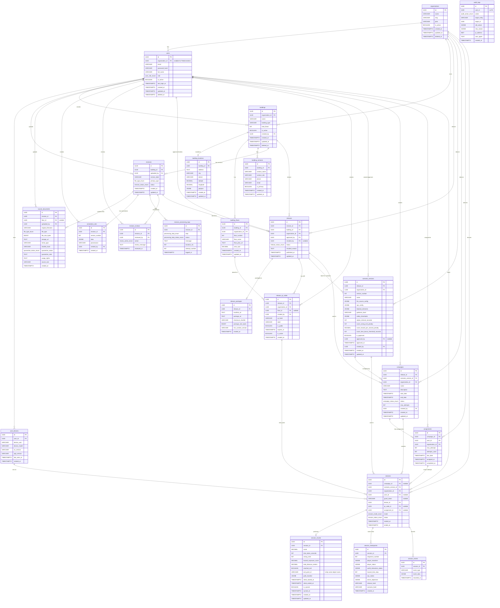

```mermaid
erDiagram

    %% =============================================
    %% GROUP 1: MULTI-TENANT & USER MANAGEMENT
    %% =============================================

    organizations {
        UUID id PK
        VARCHAR name
        VARCHAR slug
        VARCHAR plan
        BOOLEAN is_active
        TIMESTAMPTZ created_at
        TIMESTAMPTZ updated_at
        TIMESTAMPTZ deleted_at
    }

    users {
        UUID id PK
        UUID organization_id FK "nullable for PlatformAdmin"
        VARCHAR email
        VARCHAR password_hash
        VARCHAR full_name
        user_role_enum role
        BOOLEAN is_active
        TIMESTAMPTZ last_login_at
        TIMESTAMPTZ created_at
        TIMESTAMPTZ updated_at
        TIMESTAMPTZ deleted_at
    }

    user_devices {
        UUID id PK
        UUID user_id FK
        VARCHAR device_uuid
        VARCHAR device_model
        VARCHAR os_version
        VARCHAR app_version
        TIMESTAMPTZ last_seen_at
        TIMESTAMPTZ created_at
    }

    %% =============================================
    %% GROUP 2: BUILDING MANAGEMENT
    %% =============================================

    buildings {
        UUID id PK
        UUID organization_id FK
        VARCHAR name
        VARCHAR building_type
        INT total_floors
        BOOLEAN is_active
        UUID created_by FK
        TIMESTAMPTZ created_at
        TIMESTAMPTZ updated_at
        TIMESTAMPTZ deleted_at
    }

    building_locations {
        UUID id PK
        UUID building_id FK
        TEXT address
        VARCHAR city
        VARCHAR district
        DECIMAL latitude
        DECIMAL longitude
        JSONB geojson
        TIMESTAMPTZ created_at
        TIMESTAMPTZ updated_at
    }

    building_floors {
        UUID id PK
        UUID building_id FK
        UUID organization_id FK
        INT floor_number
        VARCHAR floor_name
        TEXT floor_plan_url
        DECIMAL area_sqm
        TIMESTAMPTZ created_at
        TIMESTAMPTZ updated_at
    }

    building_contacts {
        UUID id PK
        UUID building_id FK
        VARCHAR contact_name
        VARCHAR contact_role
        VARCHAR phone
        VARCHAR email
        BOOLEAN is_primary
        TIMESTAMPTZ created_at
        TIMESTAMPTZ updated_at
    }

    %% =============================================
    %% GROUP 3: BIM PIPELINE
    %% =============================================

    revisions {
        UUID id PK
        UUID building_id FK
        UUID uploaded_by FK
        VARCHAR version_label
        file_type_enum primary_type
        revision_status_enum status
        TIMESTAMPTZ created_at
        TIMESTAMPTZ updated_at
    }

    source_documents {
        UUID id PK
        UUID revision_id FK
        UUID floor_id FK "nullable"
        UUID uploaded_by FK
        VARCHAR original_filename
        file_type_enum file_type
        BIGINT file_size_bytes
        TEXT storage_url
        VARCHAR mime_type
        VARCHAR sha256_hash
        quarantine_status_enum quarantine_status
        TEXT quarantine_note
        TEXT usage_rights
        VARCHAR source_tool
        TIMESTAMPTZ created_at
    }

    annotation_sets {
        UUID id PK
        UUID revision_id FK
        INT version_number
        JSONB data
        VARCHAR provenance
        UUID created_by FK
        TIMESTAMPTZ created_at
    }

    revision_processing_logs {
        UUID id PK
        UUID revision_id FK
        processing_step_enum step
        processing_step_status_enum status
        TEXT message
        INT duration_ms
        INT attempt_number
        TIMESTAMPTZ logged_at
    }

    revision_reviews {
        UUID id PK
        UUID revision_id FK
        UUID reviewed_by FK
        review_action_enum action
        TEXT review_message
        TIMESTAMPTZ reviewed_at
    }

    %% =============================================
    %% GROUP 4: RELEASE MANAGEMENT
    %% =============================================

    releases {
        UUID id PK
        UUID revision_id FK
        UUID building_id FK
        UUID organization_id FK
        UUID approved_by FK
        UUID revoked_by FK "nullable"
        release_status_enum status
        TEXT revoked_reason
        TIMESTAMPTZ published_at
        TIMESTAMPTZ updated_at
    }

    release_packages {
        UUID id PK
        UUID release_id FK
        TEXT manifest_url
        TEXT package_url
        VARCHAR checksum_sha256
        BIGINT package_size_bytes
        VARCHAR min_runtime_version
        TIMESTAMPTZ created_at
    }

    release_qr_codes {
        UUID id PK
        UUID release_id FK
        UUID organization_id FK
        UUID floor_id FK "nullable"
        UUID created_by FK
        VARCHAR qr_hash
        VARCHAR label
        BOOLEAN is_public
        TIMESTAMPTZ expires_at
        BOOLEAN is_active
        TIMESTAMPTZ created_at
    }

    %% =============================================
    %% GROUP 5: CAMPAIGN, SCENARIO & ASSIGNMENT
    %% =============================================

    scenario_versions {
        UUID id PK
        UUID release_id FK
        UUID organization_id FK
        INT version_number
        VARCHAR name
        JSONB fire_source_config
        JSONB npc_config
        JSONB blocked_elements
        VARCHAR guidance_level
        JSONB safety_thresholds
        INT replan_interval_seconds
        INT score_wrong_exit_penalty
        DECIMAL score_hazard_per_second_penalty
        INT score_time_bonus_threshold_seconds
        BOOLEAN is_approved
        UUID approved_by FK "nullable"
        TIMESTAMPTZ approved_at
        UUID created_by FK
        TIMESTAMPTZ created_at
        TIMESTAMPTZ updated_at
    }

    campaigns {
        UUID id PK
        UUID release_id FK
        UUID scenario_version_id FK
        UUID organization_id FK
        VARCHAR name
        TEXT description
        TIMESTAMPTZ start_date
        TIMESTAMPTZ end_date
        campaign_status_enum status
        INT max_attempts
        UUID created_by FK
        TIMESTAMPTZ created_at
        TIMESTAMPTZ updated_at
    }

    assignments {
        UUID id PK
        UUID campaign_id FK
        UUID user_id FK
        UUID organization_id FK
        INT max_attempts
        INT attempts_used
        TIMESTAMPTZ due_date
        TIMESTAMPTZ assigned_at
        TIMESTAMPTZ completed_at
    }

    %% =============================================
    %% GROUP 6: SESSION & RESULTS
    %% =============================================

    sessions {
        UUID id PK
        UUID campaign_id FK "nullable"
        UUID scenario_version_id FK
        UUID organization_id FK
        UUID user_id FK "nullable"
        VARCHAR guest_token "nullable"
        UUID device_id FK
        UUID qr_code_id FK "nullable"
        UUID assignment_id FK "nullable"
        session_mode_enum mode
        session_status_enum status
        TIMESTAMPTZ started_at
        TIMESTAMPTZ ended_at
    }

    session_results {
        UUID id PK
        UUID session_id FK
        DECIMAL score
        INT time_taken_seconds
        INT wrong_exits
        DECIMAL hazard_exposure_score
        DECIMAL total_distance_meters
        BOOLEAN reached_exit
        VARCHAR exit_point_id "Unity scene object name"
        JSONB path_traveled
        TIMESTAMPTZ client_started_at
        TIMESTAMPTZ client_ended_at
        BOOLEAN is_synced
        TIMESTAMPTZ synced_at
        TIMESTAMPTZ created_at
        TIMESTAMPTZ updated_at
    }

    session_checkpoints {
        UUID id PK
        UUID session_id FK
        INT sequence_number
        JSONB player_transform
        JSONB player_status
        JSONB world_interactive_states
        INT hazard_time_step
        JSONB npc_states
        JSONB active_objectives
        VARCHAR release_hash
        VARCHAR scenario_hash
        TIMESTAMPTZ created_at
    }

    session_events {
        UUID id PK
        UUID session_id FK
        VARCHAR event_type
        JSONB event_data
        TIMESTAMPTZ recorded_at
    }

    %% =============================================
    %% GROUP 7: AUDIT
    %% =============================================

    audit_logs {
        UUID id PK
        UUID user_id "no FK"
        audit_action_enum action
        VARCHAR target_entity
        UUID target_id
        JSONB old_values
        JSONB new_values
        INET ip_address
        TEXT user_agent
        TIMESTAMPTZ created_at
    }

    %% =============================================
    %% RELATIONSHIPS
    %% =============================================

    organizations ||--o{ users : "has"
    organizations ||--o{ buildings : "owns"
    organizations ||--o{ releases : "denorm"
    organizations ||--o{ scenario_versions : "denorm"
    organizations ||--o{ campaigns : "denorm"
    organizations ||--o{ assignments : "denorm"
    organizations ||--o{ sessions : "denorm"

    users ||--o{ user_devices : "uses"
    users ||--o{ buildings : "creates"
    users ||--o{ revisions : "uploads"
    users ||--o{ source_documents : "uploads"
    users ||--o{ annotation_sets : "creates"
    users ||--o{ revision_reviews : "reviews"
    users ||--o{ releases : "approves/revokes"
    users ||--o{ release_qr_codes : "creates"
    users ||--o{ scenario_versions : "creates/approves"
    users ||--o{ campaigns : "creates"
    users ||--o{ assignments : "assigned to"
    users ||--o{ sessions : "plays"

    buildings ||--o| building_locations : "located at"
    buildings ||--o{ building_floors : "has"
    buildings ||--o{ building_contacts : "has"
    buildings ||--o{ revisions : "has versions"
    buildings ||--o{ releases : "denorm"

    revisions ||--o{ source_documents : "contains files"
    revisions ||--o{ annotation_sets : "has annotations"
    revisions ||--o{ revision_processing_logs : "logs"
    revisions ||--o{ revision_reviews : "reviewed by"
    revisions ||--o| releases : "becomes"

    releases ||--o| release_packages : "packaged as"
    releases ||--o{ release_qr_codes : "has QR"
    releases ||--o{ scenario_versions : "base for scenarios"
    releases ||--o{ campaigns : "used in"

    building_floors ||--o{ release_qr_codes : "placed on"

    scenario_versions ||--o{ campaigns : "configured by"
    scenario_versions ||--o{ sessions : "used in"
    
    campaigns ||--o{ assignments : "has assignments"
    campaigns ||--o{ sessions : "contains"

    assignments ||--o{ sessions : "tracks attempts"

    release_qr_codes ||--o{ sessions : "entry point"
    user_devices ||--o{ sessions : "runs on"

    sessions ||--o| session_results : "produces"
    sessions ||--o{ session_checkpoints : "saves state"
    sessions ||--o{ session_events : "records"
```
