# Fire Evacuation Training 3D — PostgreSQL ERD

This ERD mirrors `fire_evacuation_schema.sql` version 5.0. SQL is authoritative for defaults and check-constraint expressions; every table, column, enum-backed field, foreign key, and relationship is represented below.

## Contract notes

- `user_role_enum` is exactly `PlatformAdmin | OrganizationUser | Trainee`. `OrganizationUser` requires `organization_id`; `PlatformAdmin` and `Trainee` require it to be null.
- `file_type_enum` is exactly `IFC`.
- `ConfirmForTraining` is the persisted `revision_reviews.action` that transitions `revisions.status` from `ReadyForScenario` to `ConfirmedForTraining`; it is readiness-only. The executable order is confirmed revision/scenario → `Built` release + package + matching Active `Training` → `Published` release → active QR.
- Each `release_qr_codes` row pins both `release_id` and exactly one `training_id`. A session directly pins `trainee_user_id`, `training_id`, `scenario_version_id`, `release_id`, and `qr_code_id`; validation requires the QR-pinned Active `Training`, a `Published` release, and matching release/training/scenario/organization. QR participation never compares the Trainee to an organization or allowlist.
- A trusted PayOS adapter verifies `req.body` with the official SDK `webhooks.verify`, or canonicalizes and alphabetically sorts webhook `data` fields using the official algorithm, before database invocation. `apply_verified_payos_webhook` performs no cryptography; it records adapter attestation, deduplicates `webhook_event_id`, and compares `orderCode`, amount, and currency before recording `Paid`.
- `create_pending_payos_payment_request` derives organization, amount and currency from an unexpired `Accepted` quotation and can create only `Pending`. `fet3d_payos_request_executor` and `fet3d_payos_webhook_executor` are separate function-only `NOLOGIN` roles with no payment-table DML; the function/table owner is a separate `NOLOGIN` ledger role. Deployment must not grant ledger-owner inheritance or direct payment-table DML to runtime logins.
- `payment_transactions` is append-only once terminal, and an `Applied` transaction plus its `Paid` request provenance is immutable.
- `return_url` is UI navigation only and is never payment confirmation.

## Enum values

| Enum | Values |
|---|---|
| `user_role_enum` | `PlatformAdmin`, `OrganizationUser`, `Trainee` |
| `file_type_enum` | `IFC` |
| `revision_status_enum` | `Draft`, `Uploaded`, `Processing`, `NeedsFix`, `ReadyForScenario`, `ConfirmedForTraining`, `Rejected`, `Failed`, `Superseded` |
| `review_action_enum` | `ConfirmForTraining`, `Rejected` |
| `release_status_enum` | `Built`, `Published`, `Superseded`, `Revoked` |
| `training_status_enum` | `Draft`, `Active`, `Closed`, `Archived` |
| `quarantine_status_enum` | `Pending`, `Accepted`, `Rejected` |
| `session_mode_enum` | `Learn`, `Guided`, `Assessment` |
| `session_status_enum` | `Created`, `Launching`, `Running`, `Completed`, `CompletedWithSupersededRelease`, `ScenarioUnsurvivable`, `Aborted`, `Abandoned`, `Crashed` |
| `audit_action_enum` | `Upload`, `ConfirmForTraining`, `Reject`, `Publish`, `Revoke`, `Sync`, `Login`, `Logout`, `Download`, `Delete`, `Create`, `Update`, `Rollback`, `Grant`, `Resume`, `Payment`, `Support` |
| `processing_step_enum` | `Quarantine`, `Parse`, `CleanGeometry`, `Decimate`, `GenNavMesh`, `GenHazardGrid`, `ExportGLB`, `PackageBundle` |
| `processing_step_status_enum` | `Started`, `Success`, `Failed` |
| `quotation_status_enum` | `Draft`, `Issued`, `Accepted`, `Expired`, `Cancelled` |
| `payment_request_status_enum` | `Pending`, `Paid`, `Expired`, `Cancelled`, `Failed` |
| `payment_transaction_status_enum` | `Received`, `Verified`, `Rejected`, `Applied` |
| `feedback_status_enum` | `Submitted`, `Reviewed`, `Closed` |
| `support_ticket_status_enum` | `Open`, `InProgress`, `Resolved`, `Closed` |
| `support_priority_enum` | `Low`, `Normal`, `High`, `Urgent` |

```mermaid
erDiagram

    organizations {
        UUID id PK
        VARCHAR name
        VARCHAR slug
        VARCHAR plan
        BOOLEAN is_active
        JSONB metadata
        TIMESTAMPTZ created_at
        TIMESTAMPTZ updated_at
        TIMESTAMPTZ deleted_at
    }

    users {
        UUID id PK
        UUID organization_id FK
        VARCHAR email
        VARCHAR password_hash
        VARCHAR full_name
        user_role_enum role
        BOOLEAN is_active
        TIMESTAMPTZ last_login_at
        TIMESTAMPTZ created_at
        TIMESTAMPTZ updated_at
        TIMESTAMPTZ deleted_at
    }

    user_devices {
        UUID id PK
        UUID user_id FK
        VARCHAR device_uuid
        VARCHAR device_model
        VARCHAR os_version
        VARCHAR app_version
        TIMESTAMPTZ last_seen_at
        TIMESTAMPTZ created_at
    }

    buildings {
        UUID id PK
        UUID organization_id FK
        VARCHAR name
        VARCHAR building_type
        INT total_floors
        BOOLEAN is_active
        UUID created_by FK
        TIMESTAMPTZ created_at
        TIMESTAMPTZ updated_at
        TIMESTAMPTZ deleted_at
    }

    building_locations {
        UUID id PK
        UUID building_id FK
        TEXT address
        VARCHAR city
        VARCHAR district
        DECIMAL latitude
        DECIMAL longitude
        JSONB geojson
        TIMESTAMPTZ created_at
        TIMESTAMPTZ updated_at
    }

    building_floors {
        UUID id PK
        UUID building_id FK
        UUID organization_id FK
        INT floor_number
        VARCHAR floor_name
        TEXT floor_plan_url
        DECIMAL area_sqm
        DECIMAL elevation_meters
        BOOLEAN is_basement
        JSONB metadata
        TIMESTAMPTZ created_at
        TIMESTAMPTZ updated_at
    }

    building_contacts {
        UUID id PK
        UUID building_id FK
        VARCHAR contact_name
        VARCHAR contact_role
        VARCHAR phone
        VARCHAR email
        BOOLEAN is_primary
        TIMESTAMPTZ created_at
        TIMESTAMPTZ updated_at
    }

    revisions {
        UUID id PK
        UUID building_id FK
        UUID uploaded_by FK
        VARCHAR version_label
        file_type_enum primary_type
        revision_status_enum status
        TIMESTAMPTZ created_at
        TIMESTAMPTZ updated_at
    }

    source_documents {
        UUID id PK
        UUID revision_id FK
        UUID floor_id FK
        UUID uploaded_by FK
        VARCHAR original_filename
        file_type_enum file_type
        BIGINT file_size_bytes
        TEXT storage_url
        VARCHAR mime_type
        VARCHAR sha256_hash
        quarantine_status_enum quarantine_status
        TEXT quarantine_note
        TEXT usage_rights
        VARCHAR source_tool
        TIMESTAMPTZ created_at
    }

    annotation_sets {
        UUID id PK
        UUID revision_id FK
        INT version_number
        JSONB data
        VARCHAR provenance
        UUID created_by FK
        TIMESTAMPTZ created_at
    }

    revision_processing_logs {
        UUID id PK
        UUID revision_id FK
        processing_step_enum step
        processing_step_status_enum status
        TEXT message
        INT duration_ms
        INT attempt_number
        TIMESTAMPTZ logged_at
    }

    revision_reviews {
        UUID id PK
        UUID revision_id FK
        UUID scenario_version_id FK
        UUID reviewed_by FK
        UUID annotation_set_id FK
        review_action_enum action
        TEXT review_message
        TIMESTAMPTZ reviewed_at
    }

    scenario_versions {
        UUID id PK
        UUID revision_id FK
        UUID organization_id FK
        INT version_number
        VARCHAR name
        JSONB fire_source_config
        JSONB npc_config
        JSONB blocked_elements
        VARCHAR guidance_level
        JSONB safety_thresholds
        INT replan_interval_seconds
        INT score_wrong_exit_penalty
        DECIMAL score_hazard_per_second_penalty
        INT score_time_bonus_threshold_seconds
        UUID created_by FK
        TIMESTAMPTZ created_at
        TIMESTAMPTZ updated_at
    }

    releases {
        UUID id PK
        UUID revision_id FK
        UUID scenario_version_id FK
        UUID building_id FK
        UUID organization_id FK
        UUID published_by FK
        UUID revoked_by FK
        release_status_enum status
        JSONB safety_thresholds
        TEXT revoked_reason
        TIMESTAMPTZ published_at
        TIMESTAMPTZ updated_at
    }

    release_packages {
        UUID id PK
        UUID release_id FK
        TEXT manifest_url
        TEXT package_url
        VARCHAR checksum_sha256
        BIGINT package_size_bytes
        VARCHAR min_runtime_version
        TIMESTAMPTZ created_at
    }

    release_qr_codes {
        UUID id PK
        UUID release_id FK
        UUID training_id FK
        UUID organization_id FK
        UUID floor_id FK
        UUID created_by FK
        VARCHAR qr_hash
        VARCHAR label
        TIMESTAMPTZ expires_at
        BOOLEAN is_active
        TIMESTAMPTZ created_at
    }

    trainings {
        UUID id PK
        UUID release_id FK
        UUID scenario_version_id FK
        UUID organization_id FK
        VARCHAR name
        TEXT description
        TIMESTAMPTZ start_date
        TIMESTAMPTZ end_date
        training_status_enum status
        session_mode_enum mode
        TEXT_ARRAY allowed_modes
        INT max_attempts
        UUID created_by FK
        TIMESTAMPTZ created_at
        TIMESTAMPTZ updated_at
    }

    sessions {
        UUID id PK
        UUID training_id FK
        UUID release_id FK
        UUID scenario_version_id FK
        UUID organization_id FK
        UUID trainee_user_id FK
        UUID device_id FK
        UUID qr_code_id FK
        VARCHAR app_version
        VARCHAR unity_version
        session_mode_enum mode
        session_status_enum status
        TIMESTAMPTZ started_at
        TIMESTAMPTZ ended_at
    }

    session_results {
        UUID id PK
        UUID session_id FK
        DECIMAL score
        INT time_taken_seconds
        INT wrong_exits
        DECIMAL hazard_exposure_score
        DECIMAL total_distance_meters
        BOOLEAN reached_exit
        VARCHAR exit_point_id
        JSONB path_traveled
        TIMESTAMPTZ client_started_at
        TIMESTAMPTZ client_ended_at
        BOOLEAN is_synced
        TIMESTAMPTZ synced_at
        TIMESTAMPTZ created_at
        TIMESTAMPTZ updated_at
    }

    session_checkpoints {
        UUID id PK
        UUID session_id FK
        INT sequence_number
        JSONB player_transform
        JSONB player_status
        JSONB world_interactive_states
        INT hazard_time_step
        JSONB npc_states
        JSONB active_objectives
        VARCHAR release_hash
        VARCHAR scenario_hash
        TIMESTAMPTZ created_at
    }

    debrief_artifacts {
        UUID id PK
        UUID session_id FK
        JSONB trajectory_heatmap
        JSONB optimal_path
        JSONB wrong_decisions
        JSONB hazard_timeline
        JSONB npc_summary
        BOOLEAN is_visible_to_trainee
        TIMESTAMPTZ generated_at
    }

    session_events {
        UUID id PK
        UUID session_id FK
        VARCHAR event_type
        JSONB event_data
        TIMESTAMPTZ recorded_at
    }

    audit_logs {
        UUID id PK
        UUID user_id
        audit_action_enum action
        VARCHAR target_entity
        UUID target_id
        JSONB old_values
        JSONB new_values
        INET ip_address
        TEXT user_agent
        TIMESTAMPTZ created_at
    }

    service_packages {
        UUID id PK
        VARCHAR code
        VARCHAR name
        TEXT description
        DECIMAL unit_price
        VARCHAR currency
        INT duration_months
        JSONB features
        BOOLEAN is_active
        UUID created_by FK
        TIMESTAMPTZ created_at
        TIMESTAMPTZ updated_at
    }

    quotations {
        UUID id PK
        UUID organization_id FK
        UUID service_package_id FK
        UUID requested_by FK
        UUID issued_by FK
        VARCHAR quotation_number
        quotation_status_enum status
        INT quantity
        DECIMAL unit_price
        DECIMAL subtotal_amount
        DECIMAL tax_amount
        DECIMAL discount_amount
        DECIMAL total_amount
        VARCHAR currency
        TIMESTAMPTZ valid_until
        TIMESTAMPTZ issued_at
        TIMESTAMPTZ accepted_at
        TIMESTAMPTZ created_at
        TIMESTAMPTZ updated_at
    }

    payos_payment_requests {
        UUID id PK, FK
        UUID quotation_id FK
        UUID organization_id FK
        UUID requested_by FK
        BIGINT order_code
        DECIMAL expected_amount
        VARCHAR expected_currency
        TEXT checkout_url
        TEXT return_url
        TEXT cancel_url
        payment_request_status_enum status
        UUID paid_transaction_id FK
        TIMESTAMPTZ expires_at
        TIMESTAMPTZ paid_at
        TIMESTAMPTZ created_at
        TIMESTAMPTZ updated_at
    }

    payment_transactions {
        UUID id PK
        UUID payment_request_id FK
        VARCHAR webhook_event_id
        VARCHAR provider_transaction_id
        BIGINT received_order_code
        DECIMAL received_amount
        VARCHAR received_currency
        BOOLEAN signature_verified
        payment_transaction_status_enum status
        JSONB raw_payload
        TEXT rejection_reason
        TIMESTAMPTZ received_at
        TIMESTAMPTZ signature_verified_at
        TIMESTAMPTZ processed_at
    }

    invoice_metadata {
        UUID id PK
        UUID payment_transaction_id FK
        UUID quotation_id FK
        UUID organization_id FK
        VARCHAR invoice_number
        TEXT legal_name
        VARCHAR tax_code
        TEXT billing_address
        DECIMAL subtotal_amount
        DECIMAL tax_amount
        DECIMAL total_amount
        VARCHAR currency
        TIMESTAMPTZ issued_at
        TEXT invoice_url
        TIMESTAMPTZ created_at
        TIMESTAMPTZ updated_at
    }

    feedback {
        UUID id PK
        UUID submitted_by FK
        UUID organization_id FK
        UUID session_id FK
        VARCHAR category
        INT rating
        TEXT message
        feedback_status_enum status
        UUID reviewed_by FK
        TIMESTAMPTZ reviewed_at
        TIMESTAMPTZ created_at
        TIMESTAMPTZ updated_at
    }

    support_tickets {
        UUID id PK
        VARCHAR ticket_number
        UUID created_by FK
        UUID organization_id FK
        UUID session_id FK
        UUID feedback_id FK
        UUID assigned_to FK
        VARCHAR subject
        TEXT description
        support_priority_enum priority
        support_ticket_status_enum status
        TIMESTAMPTZ resolved_at
        TIMESTAMPTZ created_at
        TIMESTAMPTZ updated_at
    }

    organizations o|--o{ users : scopes
    users ||--o{ user_devices : registers

    organizations ||--o{ buildings : owns
    users ||--o{ buildings : creates
    buildings ||--o| building_locations : has
    buildings ||--o{ building_floors : contains
    organizations ||--o{ building_floors : scopes
    buildings ||--o{ building_contacts : has

    buildings ||--o{ revisions : versions
    users ||--o{ revisions : uploads
    revisions ||--o{ source_documents : contains
    building_floors o|--o{ source_documents : locates
    users ||--o{ source_documents : uploads
    revisions ||--o{ annotation_sets : annotates
    users ||--o{ annotation_sets : creates
    revisions ||--o{ revision_processing_logs : logs
    revisions ||--o{ revision_reviews : reviews
    scenario_versions ||--o{ revision_reviews : confirms
    users ||--o{ revision_reviews : performs
    annotation_sets o|--o{ revision_reviews : references

    revisions ||--o{ scenario_versions : configures
    organizations ||--o{ scenario_versions : owns
    users ||--o{ scenario_versions : creates

    revisions ||--o{ releases : pins
    scenario_versions ||--o{ releases : pins
    buildings ||--o{ releases : publishes
    organizations ||--o{ releases : owns
    users o|--o{ releases : publishes
    users o|--o{ releases : revokes
    releases ||--o| release_packages : packages
    releases ||--o{ release_qr_codes : exposes
    trainings ||--o{ release_qr_codes : binds
    organizations ||--o{ release_qr_codes : owns
    building_floors o|--o{ release_qr_codes : places
    users ||--o{ release_qr_codes : creates

    releases ||--o{ trainings : uses
    scenario_versions ||--o{ trainings : configures
    organizations ||--o{ trainings : owns
    users ||--o{ trainings : creates

    trainings ||--o{ sessions : groups
    releases ||--o{ sessions : pins
    scenario_versions ||--o{ sessions : runs
    organizations ||--o{ sessions : aggregates
    users ||--o{ sessions : participates
    user_devices ||--o{ sessions : runs
    release_qr_codes ||--o{ sessions : starts
    sessions ||--o| session_results : produces
    sessions ||--o{ session_checkpoints : saves
    sessions ||--o| debrief_artifacts : summarizes
    sessions ||--o{ session_events : records

    users ||--o{ service_packages : creates
    organizations ||--o{ quotations : receives
    service_packages ||--o{ quotations : prices
    users ||--o{ quotations : requests
    users o|--o{ quotations : issues
    quotations ||--o{ payos_payment_requests : requests
    organizations ||--o{ payos_payment_requests : owns
    users ||--o{ payos_payment_requests : initiates
    payos_payment_requests ||--o{ payment_transactions : receives
    payment_transactions o|--o| payos_payment_requests : confirms
    payment_transactions ||--o| invoice_metadata : invoices
    quotations ||--o{ invoice_metadata : documents
    organizations ||--o{ invoice_metadata : owns

    users ||--o{ feedback : submits
    organizations o|--o{ feedback : scopes
    sessions o|--o{ feedback : concerns
    users o|--o{ feedback : reviews
    users ||--o{ support_tickets : opens
    organizations o|--o{ support_tickets : scopes
    sessions o|--o{ support_tickets : concerns
    feedback o|--o{ support_tickets : originates
    users o|--o{ support_tickets : handles
```

